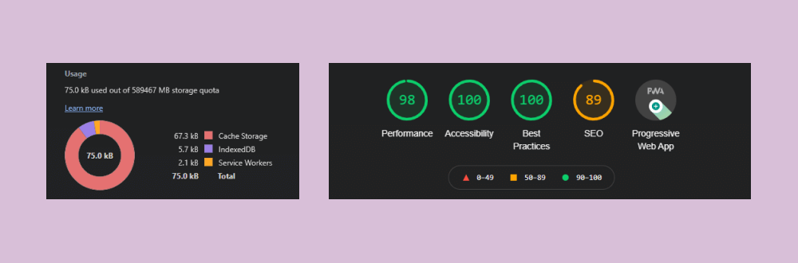
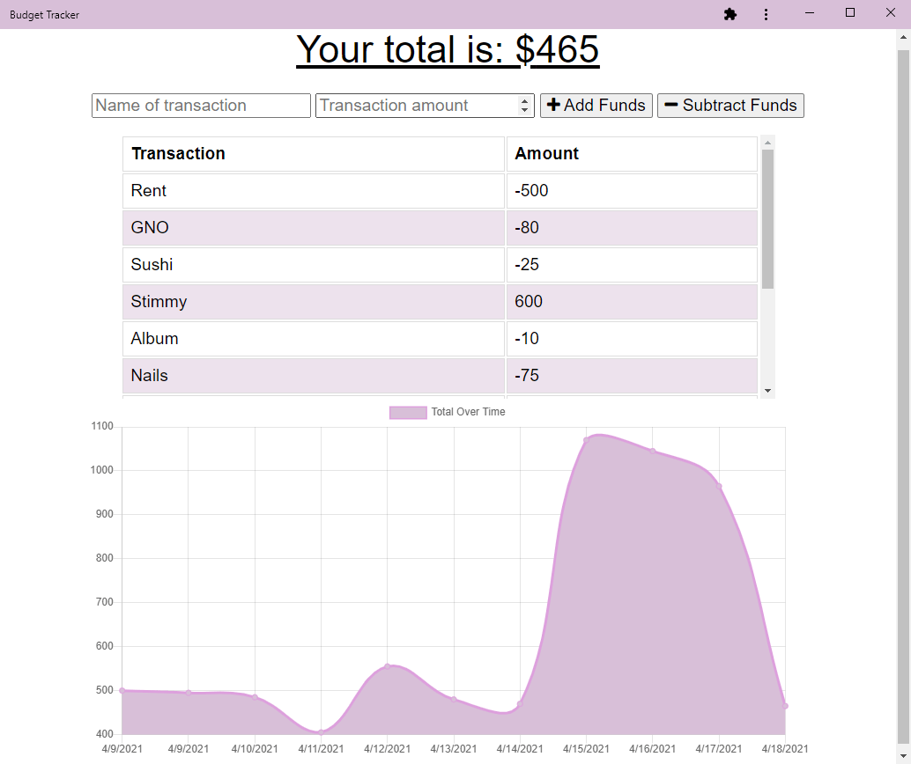

# Progressive Budget Tracker

### This progressive web app lets a user add expenses and deposits to their budget on the go, with or without a connection.

## *Table of Contents*

- [Description](#description)
- [Installation](#installation)
- [Usage](#usage)
- [Screenshots](#screenshots)
- [Contact](#contact)

## *Description*

Using IndexedDB, service workers and caching, this progressive web app lets business travellers add expenses and deposits to their budget on the go, with or without a network connection. Giving users a fast and easy way to track their money is important, but allowing them to access that information anytime is even more important.

## *Installation*

### Local Clone

#### Navigate into the repository folder on your local machine and open the built-in terminal. You will need Node.js installed to run this application.

- On the command line, type `npm i` to pull the app's dependencies to your local.
- Type `npm start` to run the application locally.
- Navigate to `http://localhost:3000` to view the development server.

### Installing the PWA for Devices

#### For Desktop

- Click the install icon in the browser navigator.
- Confirm the download and the browser window will close, opening instead as a standalone app.

#### For Mobile

- Open the browser's `Share` tab.
- Scroll down and tap `Add to Home screen`.
- Confirm by tapping `Add`.
- A shortcut will be added to the homescreen.

## *Usage*

- Using the inline form at the top of the page, enter a new `Name of transaction` and amount, then choose the submit type — `Add Funds` for a deposit and `Subtract Funds` for an expense.
- View charted data in the graph below.

- To test offline functionality, open DevTools and navigate to the `Network` tab.
    - Using the dropdown menu, select `Offline` to simulate a lack of network connection and refresh.
    - Enter a new transaction. The service worker and POST will throw errors, but the IndexedDB will pick up the slack. Navigate to the `Application` tab.
    - On the leftside panel, expand `IndexedDB` -> `budget` -> `pending`. You may need to refresh the IndexedDB to see the new pending transactions.
    - This is where we can see offline transactions queued.
- Return to the `Network` tab and set the dropdown menu back to `No throttling`, then refresh the page.
- The pending entries will now be added to the database and data cache.

## *Screenshots*

## *Contact*

🔗 Links in Bio @[katsign](https://github.com/katsign)

---
This project is MIT licensed. &copy; 2021
